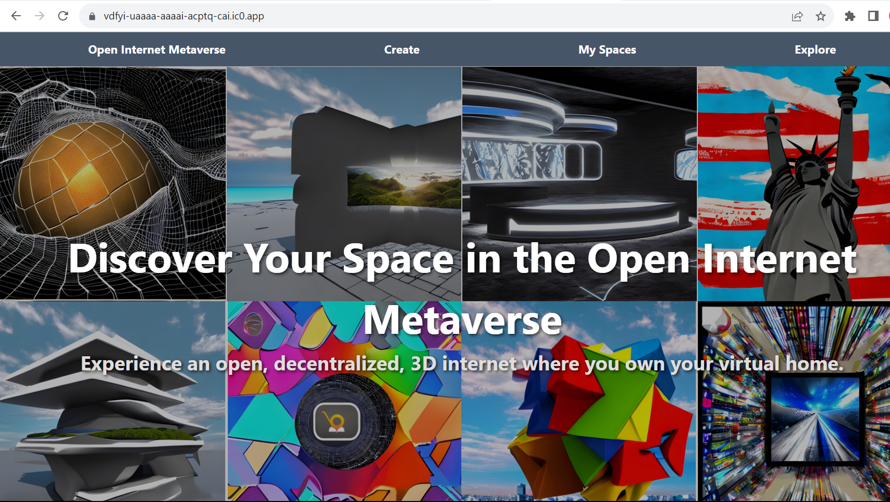

# Open Internet Metaverse (OIM)
Welcome to the next frontier of the Internet: A decentralized, user-centric, 3D metaverse powered by the Internet Computer.

## Overview
The Open Internet Metaverse (OIM) is not just a vision; it's live and operational on the Internet Computer. Our platform derives its name from the foundational belief that the Internet itself is already a Metaverse. OIM takes this vision further, creating a 3D Web experience where users can build, own, and navigate "Webspaces" — 3D Web pages that render interactive scenes right from their browsers.

### Try the OIM App
[Experience OIM Live!](https://vdfyi-uaaaa-aaaai-acptq-cai.ic0.app/)



### As a user
If you like, take a look at our [User Guide](./resources/user_guide.md)


### As a developer
If you like, take a look at our [Integration Guide](./resources/integration_guide.md)


## Features
- Fully Operational on the Internet Computer: Experience the metaverse today, live on the Internet Computer.

- User-centric Webspaces: Create your virtual spaces, host them like Websites on the Internet Computer, but in 3D. Embed objects, images, videos, and more. Make it your personal corner of the 3D Web.

- Virtual Neighborhoods: Link your space to others', forming a connected, expansive, and personalized virtual neighborhood within the greater Metaverse (or simply, as we like to think of it, the Internet).

- Decentralized & Open: An environment that ensures the metaverse remains open, free, and not under the control of any one entity.

- Compatibility: Seamlessly integrates with current Web technologies, ensuring developers have a familiar ground.

- Built with A-Frame: OIM leverages A-Frame, a Web framework for building 3D mixed reality experiences.


# Development & Deployment
## Running the project locally
If you want to test your project locally, you can use the following commands:

1. Install dependencies
```bash
npm install
```
2. Install Vessel which is a dependency: https://github.com/dfinity/vessel

3. Start the local replica
```bash
npm run dev
```

Note: this starts a replica which includes the canisters state stored from previous sessions.
If you want to start a clean local IC replica (i.e. all canister state is erased) run instead:
```bash
npm run erase-replica
```

4. Deploy your canisters to the replica
```bash
dfx deploy --argument "(
  principal\"$(dfx identity get-principal)\",
  record {
    logo = record {
      logo_type = \"image/png\";
      data = \"\";
    };
    name = \"PersonalWebSpace\";
    symbol = \"PWS\";
    maxLimit = 65535;
  }
)" PersonalWebSpace_backend

dfx deploy
```
--> Access frontend at http://localhost:4943/?canisterId=ryjl3-tyaaa-aaaaa-aaaba-cai

Access routes like so http://localhost:4943/?canisterId=ryjl3-tyaaa-aaaaa-aaaba-cai#/testroom
or http://localhost:4943/?canisterId=ryjl3-tyaaa-aaaaa-aaaba-cai#/space/0 (for space with spaceid 0)

Needs to be redeployed after every change to reflect changes

Alternative: Run a local vite UI (note that this had issues communicating to the backend canister for some setups in the past)
```bash
npm run vite
```
--> runs on port 3000; access routes like "http://172.30.141.44:3000/#/testroom" (same as on Mainnet)

Hot reloads with every UI change

For more detailed notes on running this locally, also see [NotesOnLocalDev.md](./notes/NotesOnLocalDev.md)

## Deployment to the Internet Computer
```bash
npm install

dfx start --background
```

Deploy to Mainnet (live IC):
Ensure that all changes needed for Mainnet deployment have been made (e.g. define HOST in store.ts)

Production Canisters:
```bash
dfx deploy --network ic --argument "(
  principal\"$(dfx identity get-principal)\",
  record {
    logo = record {
      logo_type = \"image/png\";
      data = \"\";
    };
    name = \"PersonalWebSpace\";
    symbol = \"PWS\";
    maxLimit = 65535;
  }
)" PersonalWebSpace_backend

dfx deploy --network ic
```

In case there are authentication issues, you could try this command
(Note that only authorized identities which are set up as canister controllers may deploy the production canisters)
```bash
dfx deploy --network ic --wallet "$(dfx identity --network ic get-wallet)" --argument "(
  principal\"$(dfx identity get-principal)\",
  record {
    logo = record {
      logo_type = \"image/png\";
      data = \"\";
    };
    name = \"PersonalWebSpace\";
    symbol = \"PWS\";
    maxLimit = 65535;
  }
)" PersonalWebSpace_backend

dfx deploy --network ic --wallet "$(dfx identity --network ic get-wallet)"
```

For deployment to other stages (e.g. development, testing) and setting up other stages, take a look at [these notes](./notes/NotesOnStages.md)

# Additional Notes
## Get and delete Email Subscribers
```bash
dfx canister call PersonalWebSpace_backend getEmailSubscribers
dfx canister call PersonalWebSpace_backend deleteEmailSubscriber 'j@g.com'

dfx canister call PersonalWebSpace_backend getEmailSubscribers --network ic
dfx canister call PersonalWebSpace_backend deleteEmailSubscriber 'j@g.com' --network ic
```

## Cycles for Production Canisters
Fund wallet with cycles (from ICP): https://medium.com/dfinity/internet-computer-basics-part-3-funding-a-cycles-wallet-a724efebd111

Top up cycles:
```bash
dfx identity --network=ic get-wallet
dfx wallet --network ic balance
dfx canister --network ic status PersonalWebSpace_backend
dfx canister --network ic status PersonalWebSpace_frontend
dfx canister --network ic --wallet 3v5vy-2aaaa-aaaai-aapla-cai deposit-cycles 3000000000000 PersonalWebSpace_backend
dfx canister --network ic --wallet 3v5vy-2aaaa-aaaai-aapla-cai deposit-cycles 300000000000 PersonalWebSpace_frontend
```

## Web Space NFT format
Each space in OIM is stored as an NFT. 

For details, please [find the format here](./resources/WebSpaceNftFormat.md) and [Types.mo in PersonalWebSpace_backend](./src/PersonalWebSpace_backend/Types.mo)
